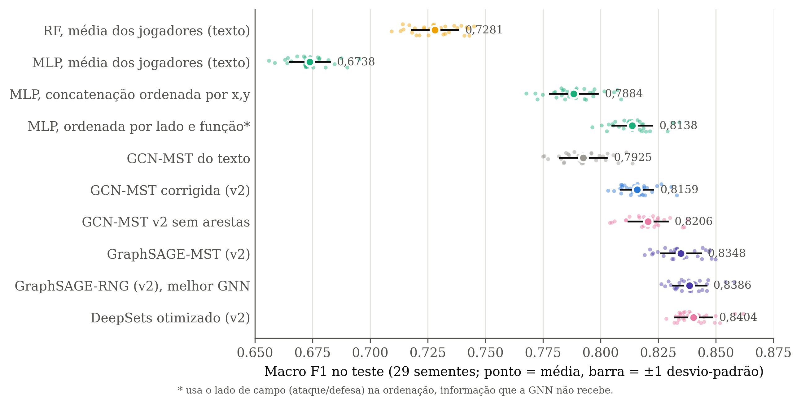
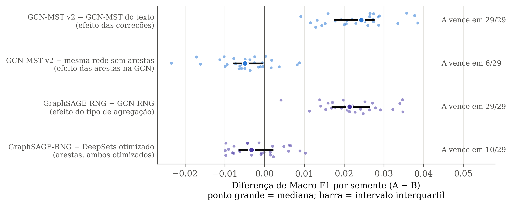
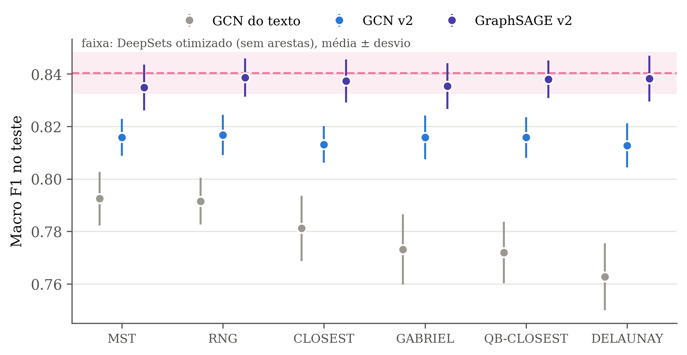
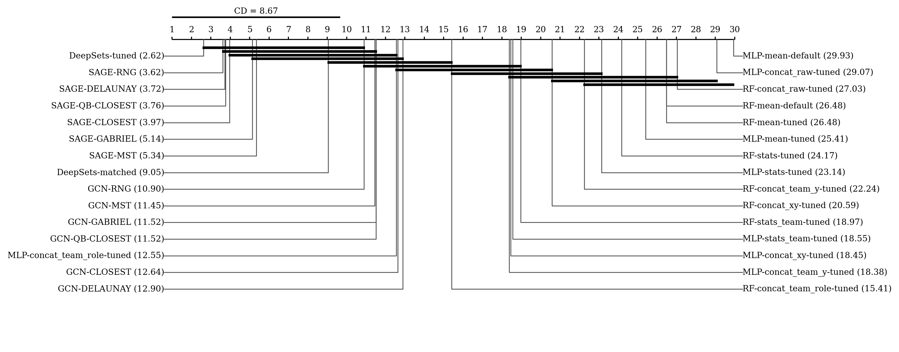
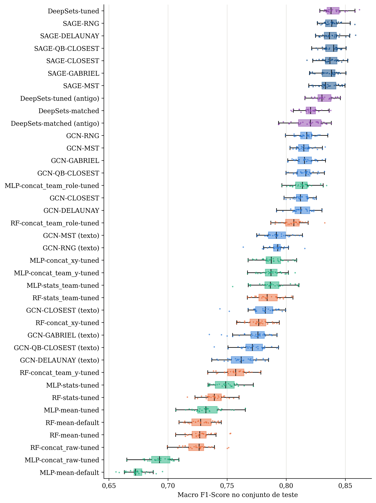
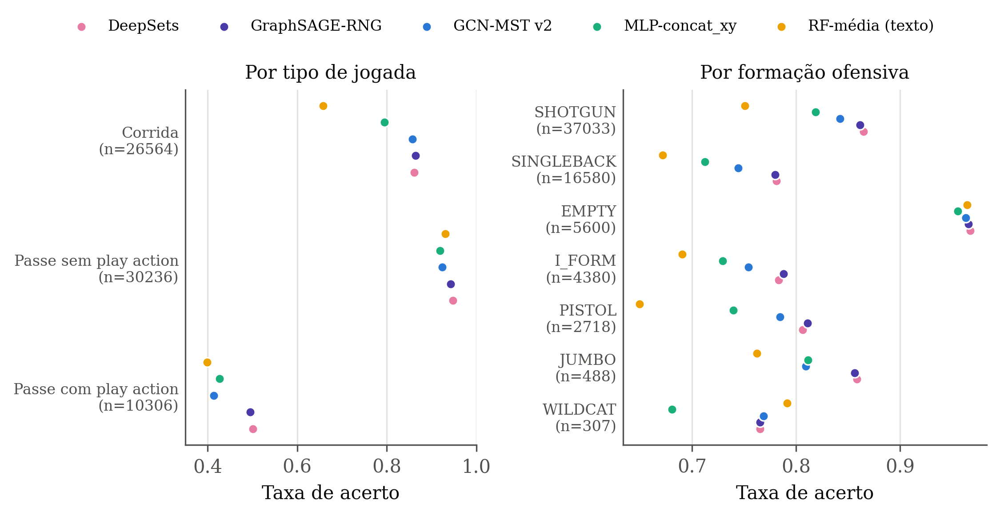
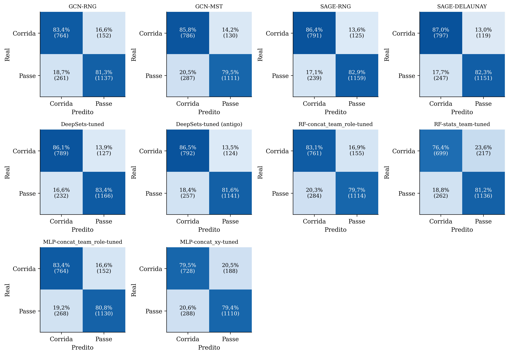

# Resultados: benchmark passe × corrida com GNN, DeepSets e baselines

Análise da bateria de 08 a 10/10/2026 (protocolo v2). Como tudo foi configurado e executado está em [PROTOCOLO.md](PROTOCOLO.md). Os números vêm dos arquivos desta pasta:
- `output/comparacao_justa/analise/resumo.csv`;
- `friedman_nemenyi.txt` e `wilcoxon_vs_ref.csv`, na mesma pasta;
- `output/comparacao_justa/analise/extra/`.

O mesmo conteúdo, com as figuras, está em `relatorio/index.html`.

- 38 configurações, 29 sementes (1–29), 2.314 jogadas de teste por semente, mesma divisão para todos os modelos.
- Métrica principal: Macro F1 no teste. Os valores são média ± desvio-padrão nas 29 sementes.

---

## 1. Principais achados

1. **O melhor modelo não usa arestas.** O DeepSets otimizado (0,8404 ± 0,0080) e a melhor GraphSAGE (RNG, 0,8386 ± 0,0073) empatam: diferença de 0,0017, a GraphSAGE vence em 10 de 29 sementes, Wilcoxon com Holm p = 0,26.
2. **A crítica do Prof. Marcos se confirmou.** Trocar a média dos jogadores pela concatenação ordenada levou o MLP de 0,6738 para 0,7884 (+0,115, 29 de 29 sementes). Grande parte da vantagem da GCN no texto vinha da informação que a média descartava.
3. **As correções melhoraram a GCN em todas as topologias.** A GCN-MST foi de 0,7925 para 0,8159 (+0,023, 29 de 29 sementes). Na DELAUNAY, o ganho foi de +0,050.
4. **Mesmo corrigida, a GCN fica abaixo de si mesma sem arestas.** Com os mesmos hiperparâmetros, tirar as arestas leva a 0,8206: a GCN vence em só 6 de 29 sementes, p de Holm = 0,006. A GCN mistura cada jogador com os vizinhos e perde informação individual.
5. **A forma de agregar os vizinhos importa.** A GraphSAGE, que dá pesos separados ao próprio jogador e aos vizinhos, supera a GCN em todas as 6 topologias (+0,019 a +0,026; 29 de 29 sementes na RNG). Ela chega ao nível do DeepSets, mas não passa dele.
6. **A escolha da topologia quase não importa mais.** No texto, a MST superava a DELAUNAY por 0,030. Na v2, todas as GCN ficam entre 0,8128 e 0,8167, e todas as GraphSAGE entre 0,8348 e 0,8386. A vantagem das topologias enxutas era, em boa parte, efeito das arestas em um sentido só.
7. **Os erros restantes se concentram em play action e RPO,** jogadas desenhadas para parecer outra coisa no snap. Os melhores modelos acertam ~50% dos passes com play action e ~95% dos passes sem play action.
8. **O tempo de inferência não é obstáculo:** de 0,02 a 3,4 ms por jogada, contra até 40 s entre jogadas.

---

## 2. Da média dos jogadores ao melhor modelo

*Figura 1. Macro F1 no teste em 29 sementes. Ponto pequeno = semente; ponto grande = média; barra = ±1 desvio-padrão. O asterisco marca a única representação que usa o lado de campo (ataque/defesa) para ordenar os jogadores. Arquivo: `analise/extra/fig1_progressao.png` e `.pdf`.*

| Modelo | Macro F1 | F1 corrida | F1 passe | Rank médio (Friedman) |
|---|---|---|---|---|
| **DeepSets otimizado (v2)** | **0,8404 ± 0,0080** | 0,8144 | 0,8664 | 2,62 |
| GraphSAGE-RNG (v2) | 0,8386 ± 0,0073 | 0,8130 | 0,8643 | 3,62 |
| GraphSAGE-DELAUNAY (v2) | 0,8383 ± 0,0087 | 0,8135 | 0,8630 | 3,72 |
| GCN-MST v2 sem arestas (DeepSets-matched) | 0,8206 ± 0,0085 | 0,7966 | 0,8447 | 9,05 |
| GCN-RNG (v2) | 0,8167 ± 0,0077 | 0,7872 | 0,8462 | 10,90 |
| GCN-MST (v2) | 0,8159 ± 0,0070 | 0,7900 | 0,8418 | 11,45 |
| MLP, ordenado por lado e função* | 0,8138 ± 0,0087 | 0,7843 | 0,8433 | 12,55 |
| GCN-MST do texto | 0,7925 ± 0,0102 | 0,7529 | 0,8321 | — |
| MLP, concatenação ordenada por x,y | 0,7884 ± 0,0105 | 0,7534 | 0,8233 | 18,45 |
| RF, média dos jogadores (texto) | 0,7281 ± 0,0102 | 0,6683 | 0,7880 | 26,48 |
| MLP, média dos jogadores (texto) | 0,6738 ± 0,0088 | 0,6061 | 0,7415 | 29,93 |

\* usa informação de lado de campo que os modelos em grafo e o DeepSets não recebem.

- O RF e o MLP com a média, agora na mesma divisão da GCN, ficaram em 0,7281 e 0,6738. São valores próximos dos 0,7319 e 0,6785 da Tabela 4.1, que vinham de outra divisão (PROTOCOLO, seção 10, item 1).
- O rank médio vem do Friedman com as 30 configurações do protocolo atual.
- A tabela das 38 configurações está em `output/comparacao_justa/analise/resumo.csv` (e `resumo.tex`).

### Representações das baselines (todas otimizadas)

| Representação | RF | MLP |
|---|---|---|
| `mean` | 0,7280 | 0,7328 |
| `stats` | 0,7393 | 0,7485 |
| `concat_raw` (ordem arbitrária) | 0,7250 | 0,6931 |
| `concat_xy` | 0,7763 | 0,7884 |
| `stats_team`* | 0,7853 | 0,7873 |
| `concat_team_y`* | 0,7568 | 0,7875 |
| `concat_team_role`* | 0,8055 | 0,8138 |

- O tuning quase não mudou o RF com a média (0,7281 → 0,7280), mas levou o MLP com a média de 0,6738 para 0,7328.
- A concatenação em ordem arbitrária é a pior para o MLP. Isso mostra que a ordenação dos jogadores importa quando eles são concatenados.

---

## 3. Ablações pareadas por semente

Todos os modelos usam a mesma divisão em cada semente, então dá para comparar dois modelos semente a semente. Cada comparação isola uma mudança.

*Figura 2. Diferença de Macro F1 (A − B) em cada semente. Pontos à direita de zero = sementes em que A venceu. Arquivo: `analise/extra/fig3_diferencas_pareadas.png` e `.pdf`.*

| Comparação (A × B) | O que isola | Dif. média | A vence | p (Holm) |
|---|---|---|---|---|
| GCN-MST v2 × GCN-MST do texto | correções | +0,0234 | 29/29 | 1,0·10⁻⁷ |
| GCN-MST v2 × mesma rede sem arestas | arestas na GCN | −0,0048 | 6/29 | 0,006 |
| GraphSAGE-RNG × GCN-RNG | tipo de agregação | +0,0219 | 29/29 | 1,0·10⁻⁷ |
| GraphSAGE-RNG × DeepSets otimizado | arestas, ambos otimizados | −0,0017 | 10/29 | 0,26 |
| GraphSAGE-MST × DeepSets otimizado | idem, MST | −0,0055 | 5/29 | 0,0009 |
| DeepSets v2 × DeepSets antigo | padronização + checkpoint | +0,0088 | 26/29 | 1,7·10⁻⁵ |
| DeepSets × MLP-concat_xy | melhor baseline estritamente justa | +0,0520 | 29/29 | 1,0·10⁻⁷ |
| DeepSets × MLP-concat_team_role | melhor baseline (com lado de campo) | +0,0266 | 29/29 | 1,0·10⁻⁷ |
| GCN-RNG v2 × MLP-concat_team_role | melhor GCN × melhor baseline | +0,0029 | 20/29 | 0,19 |
| MLP-concat_xy × MLP-mean (texto) | representação | +0,1145 | 29/29 | 1,0·10⁻⁷ |

- Wilcoxon pareado por semente, com correção de Holm sobre as 27 comparações de `analise/extra/testes_pareados.csv`: 9 comparações gerais e 3 por topologia (correções, GraphSAGE × GCN e GraphSAGE × DeepSets).
- Com 29 pares, o menor p possível no Wilcoxon exato é ≈ 3,7·10⁻⁹; o 1,0·10⁻⁷ é esse piso multiplicado pelo número de testes.

**Leitura.** Ver cada jogador individualmente é o que mais importa. A troca de mensagens, do jeito que foi testada, não acrescenta nada além disso:
- a GCN perde informação ao misturar cada jogador com os vizinhos;
- a GraphSAGE pode controlar o quanto usa dos vizinhos e só empata com o DeepSets.

---

## 4. Topologias

*Figura 3. Média ± desvio-padrão por topologia. A faixa é o DeepSets otimizado (sem arestas). Arquivo: `analise/extra/fig2_topologias.png` e `.pdf`.*

| Topologia | GCN do texto | GCN v2 | Ganho com as correções | GraphSAGE v2 | GraphSAGE − DeepSets (p Holm) |
|---|---|---|---|---|---|
| MST | 0,7925 | 0,8159 | +0,023 | 0,8348 | −0,006 (0,0009) |
| RNG | 0,7916 | 0,8167 | +0,025 | 0,8386 | −0,002 (0,26) |
| CLOSEST | 0,7812 | 0,8132 | +0,032 | 0,8373 | −0,003 (0,17) |
| GABRIEL | 0,7731 | 0,8158 | +0,043 | 0,8354 | −0,005 (0,034) |
| QB-CLOSEST | 0,7720 | 0,8158 | +0,044 | 0,8380 | −0,002 (0,26) |
| DELAUNAY | 0,7628 | 0,8128 | +0,050 | 0,8383 | −0,002 (0,26) |

- As topologias que mais ganharam com as correções são as mais densas (DELAUNAY, QB-CLOSEST, GABRIEL). Com cada aresta em um sentido só, um grafo denso passava muitas mensagens numa direção arbitrária.
- Nenhuma GraphSAGE supera o DeepSets; na MST e na GABRIEL, ela fica significativamente abaixo.
- A GraphSAGE supera a GCN em todas as topologias (p de Holm ≤ 10⁻⁷; na GABRIEL, vence em 28 de 29 sementes).

---

## 5. Hiperparâmetros escolhidos

Tabela completa em PROTOCOLO.md, seção 5.4, e em `analise/extra/hiperparametros_v2.csv`.

- **O peso `1/(1+d)` foi escolhido nas 12 configurações com arestas.** Quando a rede usa os vizinhos, vale ponderar pela distância.
- O pooling com máximo (máximo ou média+máximo) aparece em 9 das 13 escolhas. Nas 6 GraphSAGE e no DeepSets, o tuning sempre escolheu pooling com máximo.
- A GraphSAGE preferiu 2–3 camadas de troca de mensagens. A GCN preferiu 1–2 camadas e redes estreitas (64 canais em 5 das 6 topologias).
- O F1 de validação do trial escolhido foi 0,827–0,833 para a GCN, 0,848–0,856 para a GraphSAGE e 0,852 para o DeepSets. A ordem é a mesma do teste.
- Época do checkpoint (mediana nas 29 sementes): de 30 a 135; parada de 47 a 173 (`analise/extra/epocas_parametros.csv`).

---

## 6. Visão geral e testes globais

- **Friedman:** χ² = 811,92, p = 3,6·10⁻¹⁵² (30 configurações, 29 sementes).
- **Nemenyi:** diferença crítica = 8,67 posições. O DeepSets e as 6 GraphSAGE formam o grupo do topo. Por esse teste, que é conservador com 30 configurações, o DeepSets ainda não se separa da GCN-RNG (8,3 posições de distância). Os Wilcoxon pareados da seção 3 são mais sensíveis para as comparações de interesse.

*Figura 4. Diagrama de diferença crítica (Nemenyi, α = 0,05). Configurações ligadas por uma barra não diferem significativamente. Arquivo: `analise/nemenyi_cd.png` e `.pdf`.*

*Figura 5. Distribuição do Macro F1 das 38 configurações, um ponto por semente. Atende ao pedido de mostrar a dispersão da Tabela 4.1. Arquivo: `analise/boxplot_macro_f1.png` e `.pdf`.*

Ranks médios (1 = melhor): DeepSets-tuned 2,62; SAGE-RNG 3,62; SAGE-DELAUNAY 3,72; SAGE-QB-CLOSEST 3,76; SAGE-CLOSEST 3,97; SAGE-GABRIEL 5,14; SAGE-MST 5,34; DeepSets-matched 9,05; GCN-RNG 10,90; GCN-MST 11,45; GCN-GABRIEL 11,52; GCN-QB-CLOSEST 11,52; MLP-concat_team_role 12,55; GCN-CLOSEST 12,64; GCN-DELAUNAY 12,90; RF-concat_team_role 15,41; e as demais baselines de 18,38 a 29,93 (`analise/friedman_nemenyi.txt`).

---

## 7. Análise de erros por tipo de jogada

Pedido do Prof. Jadson: separar jogadas triviais de jogadas difíceis. A predição de cada jogada de teste foi unida ao `plays.csv` para cinco modelos. Cada jogada cai no teste em cerca de 4 das 29 sementes, então as taxas contam predições (jogada × semente): 67.106 por modelo, sobre 15.285 jogadas distintas.

*Figura 6. Taxa de acerto por tipo de jogada e por formação ofensiva. Arquivo: `analise/extra/fig4_erros_por_tipo.png` e `.pdf`.*

| Grupo de jogadas | n (predições) | DeepSets | GraphSAGE-RNG | GCN-MST v2 | MLP-concat_xy | RF-média (texto) |
|---|---|---|---|---|---|---|
| Corrida | 26.564 | 86,1% | 86,4% | 85,8% | 79,5% | 65,8% |
| Passe sem play action | 30.236 | 94,7% | 94,3% | 92,4% | 91,9% | 93,1% |
| **Passe com play action** | 10.306 | **50,1%** | **49,5%** | **41,4%** | **42,7%** | **39,9%** |
| RPO | 7.066 | 63,1% | 62,5% | 61,6% | 56,8% | 41,9% |
| Não RPO | 60.040 | 87,0% | 86,8% | 84,3% | 82,1% | 77,9% |
| 1ª descida | 29.889 | 81,2% | 81,0% | 78,0% | 75,1% | 68,2% |
| 2ª descida | 22.873 | 83,5% | 83,2% | 80,8% | 78,5% | 73,6% |
| 3ª descida | 13.145 | 93,2% | 93,2% | 92,6% | 90,4% | 87,3% |
| 4ª descida | 1.199 | 88,0% | 88,2% | 87,5% | 85,7% | 88,0% |
| Formação EMPTY | 5.600 | 96,8% | 96,6% | 96,3% | 95,6% | 96,5% |
| Formação SHOTGUN | 37.033 | 86,5% | 86,2% | 84,2% | 81,9% | 75,1% |
| Formação SINGLEBACK | 16.580 | 78,1% | 78,0% | 74,4% | 71,2% | 67,2% |
| Formação I_FORM | 4.380 | 78,3% | 78,8% | 75,4% | 72,9% | 69,1% |
| Formação PISTOL | 2.718 | 80,6% | 81,1% | 78,5% | 74,0% | 64,9% |
| Formação JUMBO | 488 | 85,9% | 85,7% | 80,9% | 81,1% | 76,2% |
| Formação WILDCAT | 307 | 76,5% | 76,5% | 76,9% | 68,1% | 79,2% |

As tabelas completas (incluindo faixas de jardas para a primeira descida) estão em `analise/extra/acuracia_por_*.csv`.

**Jogadas triviais.** Passes sem play action, formação EMPTY (ninguém no backfield) e 3ª descida. Todos os modelos, até o RF com a média, acertam mais de 87%, porque a formação já denuncia a jogada. Das 15.285 jogadas, 51,6% foram acertadas pelos 5 modelos em todas as sementes em que caíram no teste. O DeepSets sozinho acerta sempre 78,4% delas.

**Jogadas difíceis.**
- Passes com **play action** são desenhados para parecer corrida no snap, e os melhores modelos acertam cerca de metade.
- As **RPO** deixam a decisão para depois do snap.
- Nenhuma das duas é decidível pela formação, nem por um especialista.
- **2,9%** das jogadas são erradas pelos 5 modelos em todas as sementes. Elas são 69% passes (contra 60% no total), 57% passes com play action (contra 15%), 19% RPO (contra 10,5%) e 47% formação SINGLEBACK (contra 25%). Dados em `analise/extra/dificuldade.json`.

A diferença entre os modelos aparece onde a formação carrega informação, mas é preciso ver os jogadores individualmente para extraí-la: nas corridas, o RF com a média acerta 65,8% e o DeepSets, 86,1%.

*Figura 7. Matrizes de confusão (contagens médias das 29 sementes; porcentagem por linha). Arquivo: `analise/matrizes_confusao.png` e `.pdf`.*

---

## 8. Tempo de inferência

Pergunta do Prof. Jadson sobre o uso em tempo real. Tempo por jogada com lote de 1, mediana das 29 sementes (`analise/extra/inferencia.csv`).

| Modelo | ms por jogada | Dispositivo |
|---|---|---|
| MLP (qualquer representação) | 0,02–0,05 | CPU |
| DeepSets otimizado (v2) | 0,90 | GPU |
| GraphSAGE (6 topologias) | 1,1–1,6 | GPU |
| GCN v2 (6 topologias) | 1,6–3,4 | GPU |
| RF (exceto `mean-tuned`) | 2,2–2,5 | CPU |
| RF `mean-tuned` (500 árvores) | 5,6 | CPU |

- Todos ficam milhares de vezes abaixo dos até 40 segundos entre jogadas. A inferência não limita o uso durante a partida; o limite é usar só o quadro do snap.
- Os tempos foram medidos com três processos rodando ao mesmo tempo, então são valores conservadores.
- Os modelos em grafo também precisam montar o grafo de cada jogada, e esse tempo não está incluído.

---

## 9. O que muda no texto da dissertação

| Hoje no texto | O que os dados sustentam |
|---|---|
| "superioridade da modelagem relacional"; a vantagem viria "da capacidade da GNN de interpretar a geometria espacial e a influência mútua dos jogadores" | Representar os jogadores individualmente é o fator decisivo (+0,11 a +0,17 sobre a média). A troca de mensagens não trouxe ganho além do DeepSets nas condições testadas |
| "topologias mais enxutas são as mais eficazes" e filtram "o ruído espacial redundante" | Com as arestas corrigidas, as topologias ficam a menos de 0,004 umas das outras. A diferença do texto vinha, em boa parte, das arestas em um sentido só |
| Só GCN; baselines com a média; tuning da GCN pela acurácia no teste | GCN, GraphSAGE e DeepSets com o mesmo protocolo e o mesmo orçamento de tuning na validação; baselines com sete representações. A forma de agregação importa: a GraphSAGE supera a GCN em todas as topologias |
| Análise de erros só por classe | Os erros restantes se concentram em play action e RPO, jogadas feitas para enganar no snap. Isso dá um teto natural para qualquer modelo que use só a formação |
| Tabela 4.1 sem desvio-padrão | Média ± desvio, mínimo e máximo em `resumo.csv`; boxplot na Figura 5 |
| Pergunta da banca sobre o tempo de inferência | Seção 8 |

### Limitações para declarar
Detalhes em PROTOCOLO.md, seção 11.
- Tuning com 20 trials (v2) em uma única divisão.
- Coordenadas e ângulos não normalizados pelo sentido do ataque.
- Ausência de indicador de lado de campo entre os atributos.
- Categóricas codificadas como inteiros, semana a semana.
- Uma temporada e só o quadro do snap.
- 29 sementes, e não 30.
- Só GCN e GraphSAGE entre as GNNs.
- Tempos de inferência medidos com processos simultâneos.

---

## 10. Próximos passos sugeridos

1. **Normalizar os dados para todos os modelos:** espelhar pelo sentido do ataque, medir `x` a partir da linha de scrimmage, usar seno e cosseno dos ângulos, indicador de ataque/defesa, categóricas em one-hot ou embedding e codificador único para todas as semanas. Rodar tudo de novo como um novo protocolo, guardando este.
2. **Testar a hipótese das relações com uma GNN que use posição relativa nas mensagens:** EdgeConv, ou GATv2/Transformer com atributos de aresta, num grafo completo ou com arestas tipadas (ataque–ataque, defesa–defesa, ataque–defesa). A GCN e a GraphSAGE só veem atributos absolutos dos vizinhos.
3. Se a conclusão se mantiver ("ver os jogadores individualmente é o que importa"), ela fica bem mais sólida. Se a GNN relativa passar à frente do DeepSets, a hipótese original volta com força.
